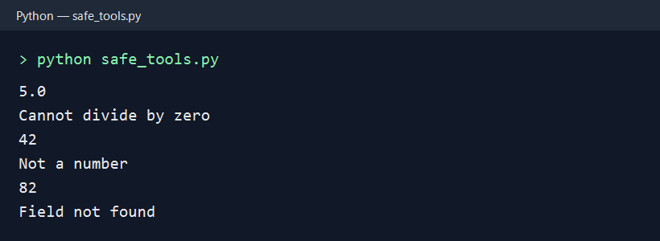

# Safe Tools and Unbreakable Input — Week 6 Python Assignment

- `safe_tools.py` defines safe division, integer conversion, and dictionary lookup functions, then prints the required example output.
- `unbreakable.py` keeps asking until the user enters a positive whole number, handling invalid text and non-positive numbers separately.
- `README.md` describes the assignment files and explains why non-numeric input requires exception handling.

An `if` check can test a value after it has been converted, but it cannot make `int("abc")` succeed: Python raises `ValueError` before the program can compare the result. Catching `ValueError` lets the program report bad text and continue, while an `if` check can separately identify a valid but unwise value such as zero or a negative number.

## Run

```sh
python safe_tools.py
python unbreakable.py
```

Expected output from `safe_tools.py`:

```text
5.0
Cannot divide by zero
42
Not a number
82
Field not found
```

## Run screenshot


